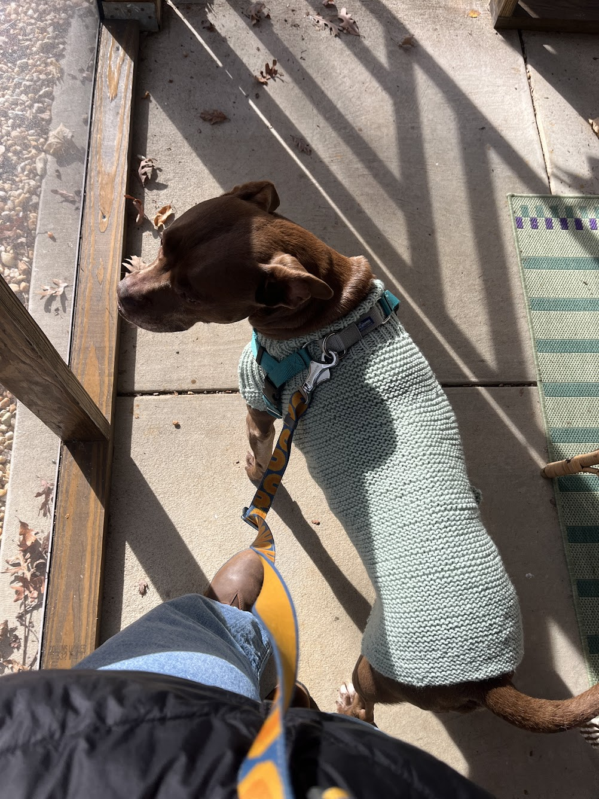
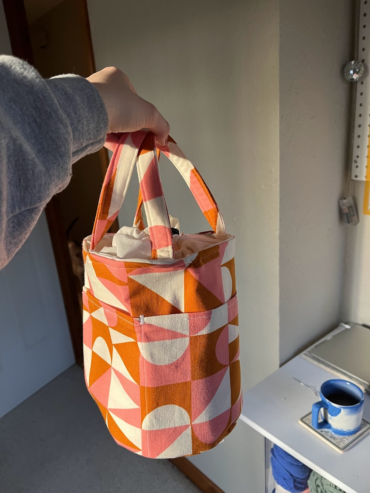
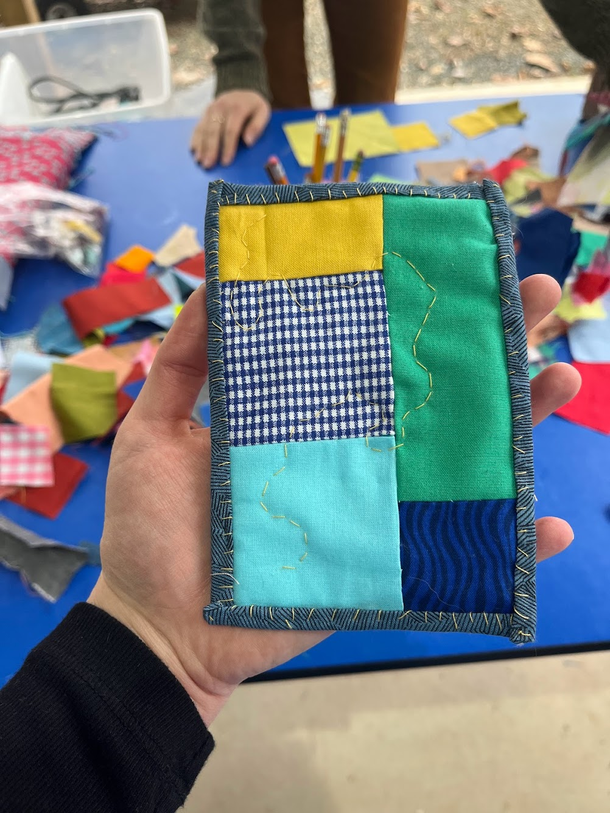

# Personal Website

## 📖 Description
### ℹ️ Overview
Welcome to the project for my personal website! The website highlights my background, resume/CV, data science portfolio, creative projects, and recommended data science resources. 

### 💡 Choosing Quarto
I wanted to use this project as an opportunity to learn how to build a Quarto website. I'm an R programmer with experience creating HTML and PDF documents in Quarto, so creating a Quarto website felt like an obvious next step in my personal _see-ya-RMarkdown-hello-Quarto-you-seem-cool_ mission.

Perhaps more importantly, as a Shiny dashboard developer, I've increasingly found myself considering projects where developing a Quarto website could be the preferred approach. This preference stems from a couple key advantages. First, I think Quarto has a gentler learning curve than Shiny. Opting for more intuitive programming tools paves the way for more efficient and collaborative development. Second, Quarto seems to have less quirks than Shiny, which seems to result in less complex dashboards/sites overall. This decreased complexity reduces the time and effort required to build and maintain the project.

### 🧠 What I Learned
- Building your own website is really fun. It took me back to MySpace days! I originally thought the website would mostly be a professional tool. In the middle of development, I had the retrospectively obvious realization that I could include anything I wanted, so I decided to create a page showcasing my creative projects. Seeing all of the things I've made in the past couple of years in a gallery makes me feel prouder of myself then reviewing academic and professional accomplishments. These tiny personal joys remind me of Dr. Fonti Kar's  [2024 useR! talk "Why Build Silly Things in R?"](https://userconf2024.sched.com/event/1c8zy/why-build-silly-things-in-r-fonti-kar-university-of-new-south-wales?iframe=yes&w=100%&sidebar=yes&bg=no) 🤠
- Quarto continues to blow me away with how easy it is to use. I initially felt intimated by the prospect of making my own website, but Quarto made the development process feel seamless!
- I think my intuition about Shiny dashboards vs. Quarto websites was spot-on. While I still see a need for both tools, you'll find me recommending Quarto websites more often given the organizational capacity limitations I'm up against.

## 🖥️ Installation
Start by **cloning the repository**.
   ```bash
   git clone https://github.com/joislohnson/personal-website.git
  ```

Next, [**install Quarto**](https://quarto.org/docs/get-started/) followed by the **Quarto extensions** used for this project:
- [**embedio**](https://github.com/coatless-quarto/embedio#readme)
   ```bash
   quarto add coatless-quarto/embedio
   ```
- [**embedpdf**](https://github.com/jmgirard/embedpdf?tab=readme-ov-file)
   ```bash
   quarto add jmgirard/embedpdf
   ```
- [**iconify**](https://github.com/mcanouil/quarto-iconify)
   ```bash
   quarto add mcanouil/quarto-iconify
   ```

## 🪟 Run the Website
To preview the website with R Studio or VS Code, select **Render** (R Studio) or **Preview** (VS Code) to render and preview the website in an embedded window.

Alternatively, you can use the Terminal.
   ```bash
   quarto preview
   ```
## 👩‍💻 Usage
I created pages for my website based on my own preferences. Feel free to use whichever page(s) you'd like as a template for your own Quarto website.
### 👋 About Page
When you provide the `about` option to your Quarto document, you can choose from 5 built-in [About Page](https://quarto.org/docs/websites/website-about.html) templates. I chose to use the trestles template and used the [iconify](https://github.com/mcanouil/quarto-iconify) extension to add custom icons beneath my headshot. 

Here's the YAML for my about page:

   ``` bash
   ---
title: "Lois Adler-Johnson"
about:
  template: trestles
  image: "files/headshot.jpg"
  links:
    - text: " LinkedIn"
      href: https://www.linkedin.com/in/loiscjohnson/
    - text: " GitHub"
      href: https://github.com/joislohnson
    - text: " Bluesky"
      href: https://bsky.app/profile/lois-aj.bsky.social
    - text: " Google Scholar"
      href: https://scholar.google.com/citations?hl=en&user=2ZLHHkEAAAAJ
    - text:  " Email"
      href: mailto:lois.c.johnson+site@gmail.com
---
   ```

### 📄 Resume/CV Page
I used the [embedpdf](https://github.com/jmgirard/embedpdf?tab=readme-ov-file) extension to embed my CV on this page.

 ``` bash

   ```

### 📚 Portfolio Page
A big part of why I wanted to create a personal website was to develop a data science portfolio. To do this, I wanted to add a [Quarto blog](https://quarto.org/docs/websites/website-blog.html) to my [Quarto website](https://quarto.org/docs/websites/). 

I did this by creating a `posts` subdirectory and a [listing page](https://quarto.org/docs/websites/website-listings.html) in the main directory.

 ``` bash
---
title: "Portfolio"
listing: 
  contents: posts # all Quarto docs in the `posts` subdirectory will be included on your listing page
  type: default
  sort: "date desc"
  categories: true
---
   ```

Within the `posts` folder, I've created a YML file with options that apply to all of my blog posts.
 ``` bash
---
# re-render posts only when a change to the source file is made
freeze: auto

# enable banner style title blocks
title-block-banner: true

# cite R packages used in analyses
bibliography: grateful-refs.bib
---
   ```
I've created subdirectories for each individual blog post within the `posts` folder. These subdirectories contain all the files necessary to run the blog post. Here's some YAML from a (specific blog post)[https://loisaj.com/posts/2024-12-24-svi-analysis/].
 ``` bash
---
title: "Wake County SVI Analysis"
description: "Mapping geographic disparities in social vulnerability factors in Wake County, NC."
author:
  - name: Lois Adler-Johnson
date: 12-24-2024
categories: [Data Viz, Quarto, R, Mapping]
format: 
  html:
   code-fold: true
   title-block-banner: "#0c2c84"
toc: true
#image: preview-image.png
draft: false # setting this to `true` will prevent your post from appearing on your listing page until you're ready
---
   ```
### 🧶 Makes Page
I wanted to include a page with an accessible layout of images of various creative projects I've worked on. Lucikly, [Quarto adds lightbox treatment](https://quarto.org/docs/output-formats/html-lightbox-figures.html) for all images in a document with the `lightbox: TRUE` option, allowing users to click and see a larger version of an image and more detailed captions. 
 ``` bash
---
title: "Makes"
lightbox: true
---
   ```
I wanted the images to be in a grid-style arrangement. After playing around with different layouts, I liked the configuration of `{layout="[1, 1, 1]"}` and a standard image size with `width="350"`.
 ``` bash
::: {layout="[1, 1, 1]"}
{group="makes" description="Wool and the Gang's [Dog's Life Coat](https://www.woolandthegang.com/en/products/dog-s-life-coat)—it's the first knitting pattern I've ever finished!" width="350"}

{group="makes" description="Bobby all cozied up in the sweater before a walk on a chilly day." width="350"}

{group="makes" description="Wool and the Gang's [Happy Blanket](https://www.woolandthegang.com/en/products/happy-blanket-kit) for my friend's sweet baby Miles." width="350"}
:::

::: {layout="[1, 1, 1]"}
{group="makes" description="Leila Make's [Lil Bucky Bag](https://www.leilamakes.com/free-pattern/lil-bucky-bag), perfect for knitting projects!" width="350"}

{group="makes" description="I learned how to improv mini quilts with Ali at the lovely [Triple Spring Studios](https://sadierapp.com/triple-spring-studios)." width="350"}

{group="makes" description="I sewed this bandana for my pals' dog Gertie out of my favorite cowboy fabric." width="350"}
:::
```
### 🌱 Resources Page
I'm often sharing resource lists with our partners, my coworkers, and students, so I wanted to compile a public list to point folks to. 

This page is the simplest of them all! For good measure, here's a snippet of what the Quarto document looks like.
 ``` bash
---
title: "Resources"
format: 
  html:
    toc: true
---

Here are some of my most referenced and shared resources. These lists are always evolving, and I welcome recommended additions!

## Data Visualization

-   [Do No Harm Guide: Applying Equity Awareness in Data Visualization](https://www.urban.org/research/publication/do-no-harm-guide-applying-equity-awareness-data-visualization)
-   [Powering Health Equity Action with Online Data Tools: 10 Design Principles](https://nationalequityatlas.org/sites/default/files/10-Design-Principles-For-Online-Data-Tools.pdf)
-   [ColorBrewer](https://colorbrewer2.org)
-   [Accessibility and Visualization](https://www.youtube.com/watch?v=KVisPxjgdtU)
-   [Chartability](https://www.frank.computer/chartability/)
```
